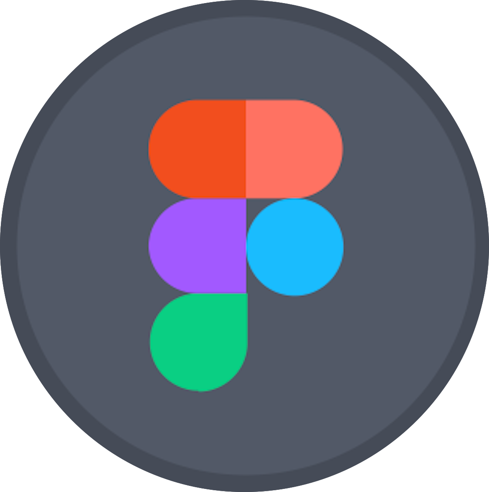
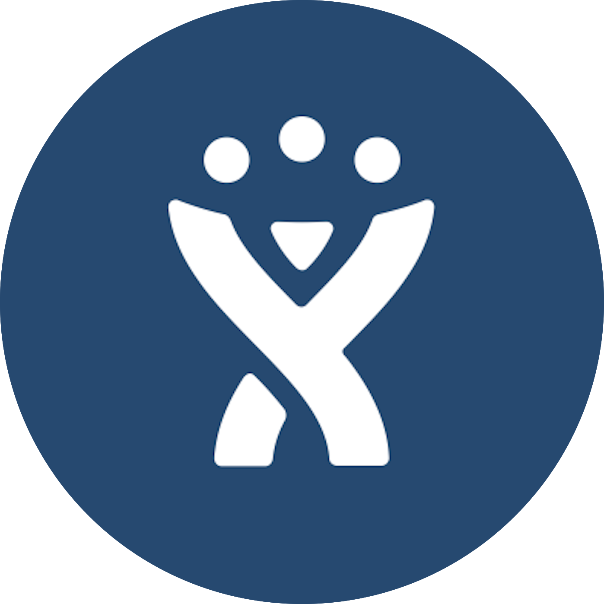

<h1 class="text-center"> Heya, I'm Sheila! </h1>

 

I'm currently working as a freelance developer and coding teacher at Le Wagon.

Most recently, I lived and worked in Melbourne, Australia- below I'll talk about some of my koalities.

<h3>Some of the technologies that I use are: </h3>

                          
 

<h3>I have experience building with the following CMS tools: </h3>
     

<h3>As a previous product manager and PM for my own projects, I have experience with: </h3>
               

<h3>I'm currently learning the following: </h3>
     

<!--
**sheesh19/sheesh19** is a ✨ _special_ ✨ repository because its `README.md` (this file) appears on your GitHub profile.

Here are some ideas to get you started:

- 🔭 I’m currently working on ...
- 🌱 I’m currently learning ...
- 👯 I’m looking to collaborate on ...
- 🤔 I’m looking for help with ...
- 💬 Ask me about ...
- 📫 How to reach me: ...
- 😄 Pronouns: ...
- ⚡ Fun fact: ...
-->
